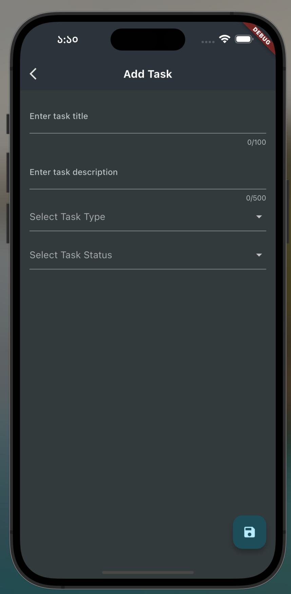

# 📋 Taskly

Taskly is a smart Flutter-powered task and note management app inspired by proven productivity techniques. Organize your tasks based on urgency and importance with a clean, minimal UI that adapts to your workflow.

---

## 🌟 Project Overview

Taskly leverages the **Eisenhower Matrix** method to help you manage tasks effectively. Prioritize what matters most by sorting tasks into four actionable categories. Quickly add, edit, delete, and search notes or tasks with ease in a dark-themed interface.

---

## 🚀 Features

✅ Categorize Tasks:

* **Urgent & Important**
* **Urgent but Not Important**
* **Not Urgent but Important**
* **Not Urgent & Not Important**

📝 Notes Management:

* Create and edit notes
* Categorize by type (General, Personal, Work, Ideas, Creativity)
* Text formatting: **bold**, *italic*, *underline*

🔍 Powerful Search:

* Search tasks or notes by title/content
* Filter by category

🗑️ Easy Deletion:

* Swipe to delete tasks and notes

🌙 Dark Mode:

* Modern UI with full dark mode support

---

## 🏗️ Code Structure & Design Pattern

The app follows a modular and scalable folder structure:

```
lib/
 ├── main.dart              # App entry point
assets/
 └── images/                # UI images and icons
```

> *Planned improvements include RiverPod, sqflite for persistent storage, and uuid for ID generation.*

---

## 📷 Screenshots


---
## Figma 
https://www.figma.com/design/NsCqIeoIYE0ZGGFwV9o7Vy/Note-taking-app-UI--Community-?m=auto&is-community-duplicate=1&fuid=1512055629313252948

## 🛠️ Getting Started

### Prerequisites

* [Flutter](https://flutter.dev/docs/get-started/install)
* Dart SDK

### Installation

1. **Clone the repository:**

   ```bash
   git clone https://github.com/yourusername/taskly.git
   cd taskly
   ```

2. **Install dependencies:**

   ```bash
   flutter pub get
   ```

3. **Run the app:**

   ```bash
   flutter run
   ```

---

## 📦 Dependencies

| Package                                                                             | Use                                |
| ----------------------------------------------------------------------------------- | ---------------------------------- |
| [`flutter`](https://flutter.dev/)                                                   | Base SDK                           |
| [`riverpod`](https://pub.dev/packages/riverpod)                                     | Planned state management           |
| [`sqflite`](https://pub.dev/packages/sqflite)                                       | Planned local DB                   |
| [`uuid`](https://pub.dev/packages/uuid)                                             | For unique IDs (planned)           |
| [`scrollable_positioned_list`](https://pub.dev/packages/scrollable_positioned_list) | Enhanced list experience (planned) |

---

## 🤝 Contributing

Pull requests and feedback are welcome! Feel free to open issues and suggest enhancements.

---

## 📄 License

This project is licensed under the [MIT License](LICENSE).

---

## 👨‍💻 Author

Created by Sourav Palin
[Buy me a coffee](https://www.buymeacoffee.com/souravpalin)

---

Let me know if you'd like me to help you write the code structure, main screen, or connect with a local database.


## Screenshot
Download apk from [here](https://drive.google.com/file/d/1NiBqaLx_fcAMUB2I2Pd0oYsFnqpo5ftm/view?usp=sharing)





